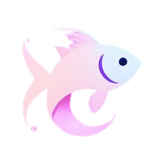
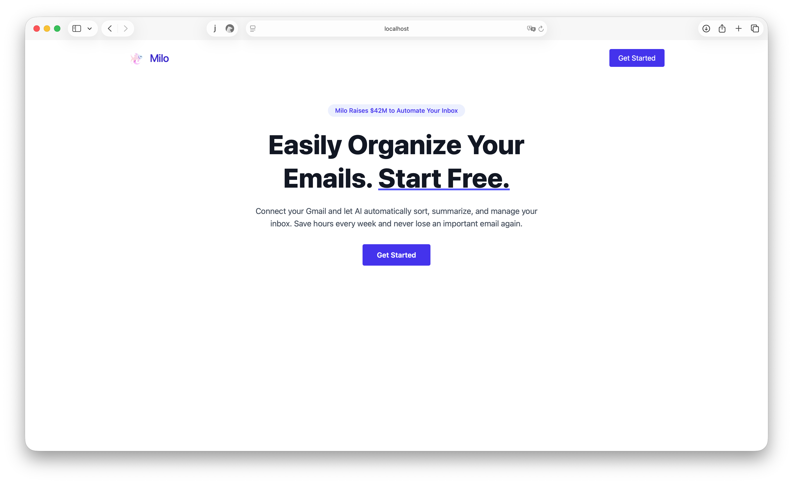
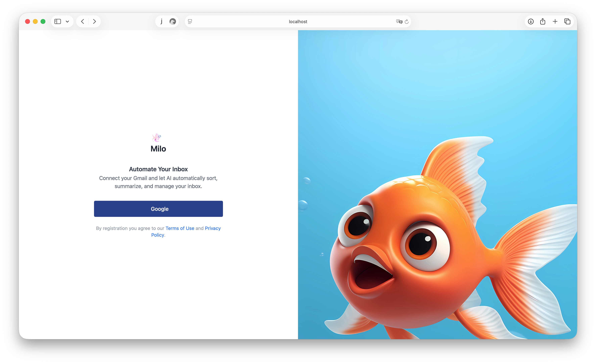
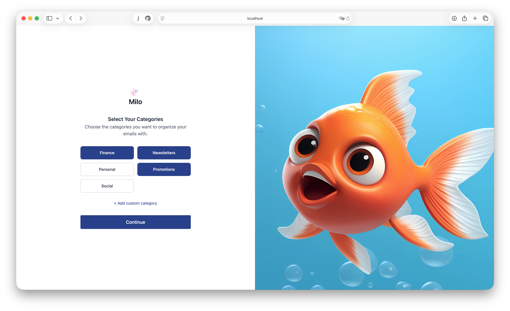
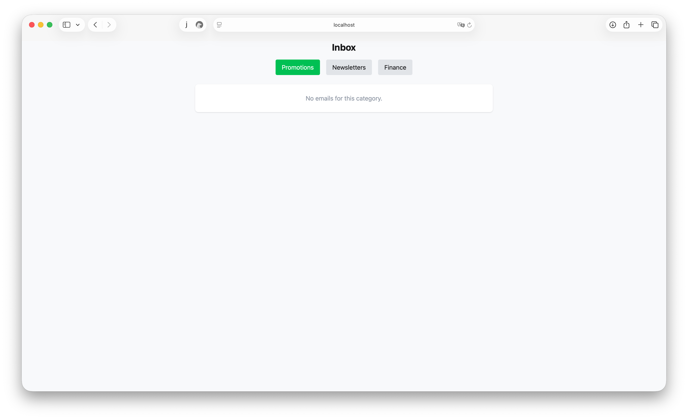

# Milo

  

Milo is an AI-powered email assistant designed to help you **organize, summarize Gmail inbox automatically**. With Milo, you can save hours every week by letting AI sort your emails, highlight important messages, and keep your inbox organized effortlessly.  

  <a href="https://miloai.fly.dev" target="_blank">Try Milo Live</a>
  

### Instructions

#### Install with Docker

[Docker](www.docker.com) is an open platform for developers and sysadmins to build, ship, and run distributed applications, whether on laptops, data center VMs, or the cloud.

If you haven't used Docker before, it would be good idea to read this article first: Install [Docker Engine](https://docs.docker.com/engine/installation/)

Install [Docker](https://www.docker.com/what-docker) and then [Docker Compose](https://docs.docker.com/compose/), and then follow the steps below:

1. Run `mix deps.get` to download dependencies.
2. Setup database:
	- `docker compose up -d db`
	- mix ecto.create
	- mix ecto.migrate
	- mix run priv/repo/seeds.exs

3. Finally, start your local server with `mix phx.server` and milo should be up and running on your localhost!

4. Aaaaand, you can run the automated tests suite running a `mix test` with no other parameters!

### Features

## Features

- **Google Account Authentication**  
  Securely connect your Gmail account with Milo using Google OAuth. No sensitive credentials are stored — authentication is handled safely through Google.

- **Real-time Email Updates**  
  Milo listens for new emails via Google Pub/Sub, ensuring that your inbox updates instantly as soon as a new message arrives.

- **Smart Email Processing & Categorization**  
  Incoming emails are automatically processed by Milo’s AI engine and sorted into categories. You can customize categories or rely on the AI to organize your inbox efficiently, helping you focus only on what matters.

  
  
  

